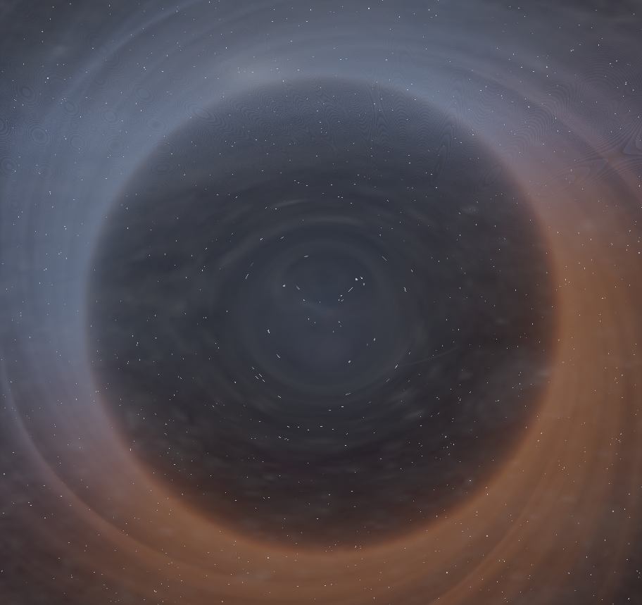
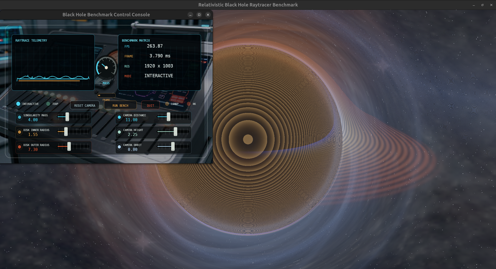
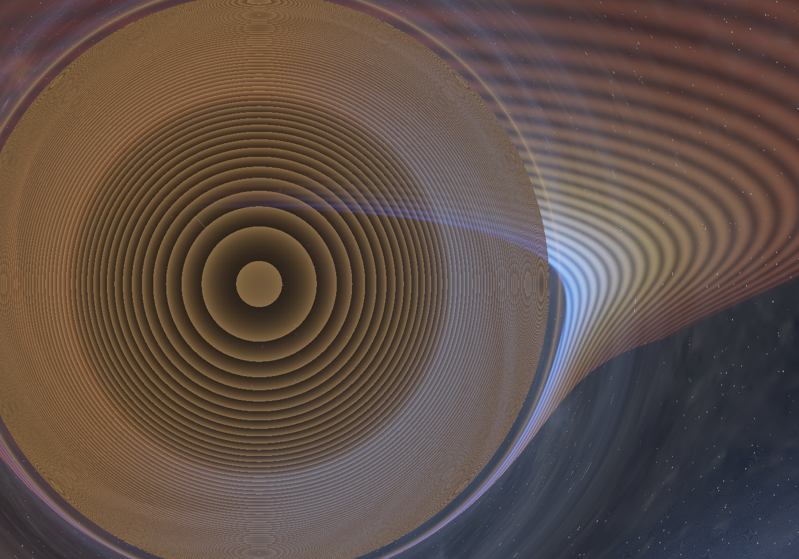
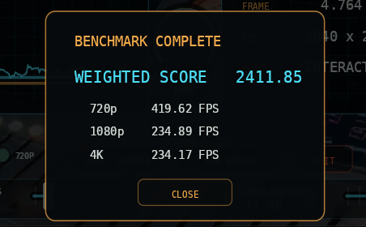

# Black Hole Benchmark

High-fidelity real-time relativistic black hole raytracer and hardware benchmark. The application uses pygame to create an OpenGL 4.6 core-profile context, ModernGL to drive a fullscreen GLSL fragment raymarcher, and GLFW plus skia-python for a separate OpenGL diagnostics/control viewport.

The render path models inverse-cube gravitational light deflection around a dynamic Schwarzschild radius, a configurable accretion disk on the horizon plane, Doppler-style blue/red disk beaming, a lensed starfield, and staged SwarmUI visual assets for the space canvas, accretion disk, singularity halo, and HUD art direction.

## See It In Action






## Capabilities

- GPU raymarching in a GLSL fragment shader through ModernGL.
- Dynamic controls for mass, disk inner radius, disk outer radius, camera distance, and camera height.
- Programmatic accretion disk with radial temperature falloff and directional Doppler tinting.
- Warped starfield that responds to gravitational lensing around the event horizon.
- Animated singularity halo using the staged `high_fidel_singularity.png` texture as live shader input.
- Independent Skia diagnostics viewport with FPS, frame time, resolution, active mode, analog gauges, and interactive physical sliders over the Z-Image-authored `vivid_control_panel.png` console material.
- Automated benchmark routine for 720p, 1080p, and 4K tiers with trimmed frame-time statistics.
- Weighted hardware score:
  `Score = (Avg_720p_FPS * 1.0) + (Avg_1080p_FPS * 2.5) + (Avg_4K_FPS * 6.0)`.
- SwarmUI orchestration script for staging visual assets from `render_backlog.md`.

## Developer Setup

Prerequisites:

- Python 3.11 in the project pyenv virtualenv.
- NVIDIA offload helper at `/usr/local/bin/nv-run.sh`.
- OpenGL 4.6-capable driver and GPU.
- Python packages installed from `requirements.txt`.
- Optional for asset generation: SwarmUI running at `http://localhost:7801` with `z_image_turbo-Q6_K.gguf` available.

Install dependencies:

```bash
python -m pip install -r requirements.txt
```

Run the app:

```bash
/usr/local/bin/nv-run.sh python benchmark.py
```

The local `nv-run.sh` helper is only a small NVIDIA PRIME offload wrapper. Its effective commands are:

```bash
NVIDIA_PROVIDER=${NVIDIA_PROVIDER:-"NVIDIA-G0"}
export __NV_PRIME_RENDER_OFFLOAD=1
export __NV_PRIME_RENDER_OFFLOAD_PROVIDER="$NVIDIA_PROVIDER"
export __GLX_VENDOR_LIBRARY_NAME=nvidia
exec "$@"
```

Without that helper, run the benchmark with the same environment:

```bash
NVIDIA_PROVIDER=${NVIDIA_PROVIDER:-"NVIDIA-G0"}
__NV_PRIME_RENDER_OFFLOAD=1 \
__NV_PRIME_RENDER_OFFLOAD_PROVIDER="$NVIDIA_PROVIDER" \
__GLX_VENDOR_LIBRARY_NAME=nvidia \
python benchmark.py
```

Run a short smoke test:

```bash
/usr/local/bin/nv-run.sh python benchmark.py --smoke-test 3
```

Run formatter and linter checks:

```bash
python -m black benchmark.py orchestrator.py
python -m flake8 benchmark.py orchestrator.py
```

Generate or stage SwarmUI assets from the backlog:

```bash
python orchestrator.py
```

Use `python orchestrator.py --dry-run` to validate backlog parsing and write a manifest without sending render requests.
